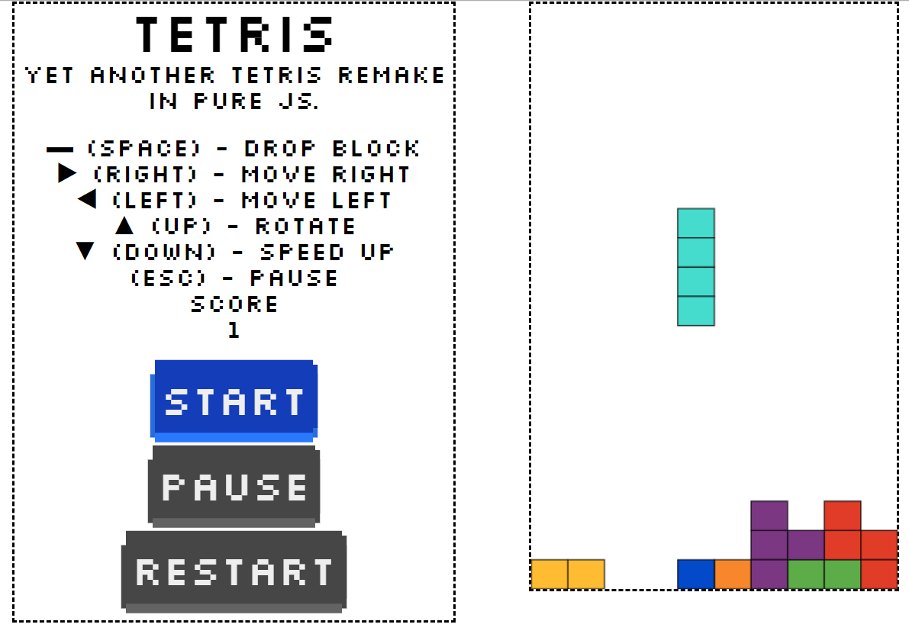

# Tetris

<p align="center">
Yet another Tetris remake in pure JS.
</br>
</br>

<a href="https://opensource.org/licenses/MIT">
  
</a>
<a href="https://travis-ci.com/Bartosz-D3V/Tetris">
  
</a>
<a href="https://github.com/prettier/prettier">
  
</a>
</br>
</br>


</p>

## About

Simple Tetris remake created in pure JavaScript and HTML5 Canvas.

<a href="https://bartosz-d3v.github.io/Tetris/">Play demo here</a>

## Install

```bash
yarn install // or
npm install
```

## Run

```bash
yarn start // or
npm start
```

## Lint

```bash
yarn lint // or
npm run lint
```

## Docker

In order to run game as a docker container, please do the following:

1. Build an image:

```bash
docker build -t tetris .
```

2. Create container

```bash
docker run -d -p 80:80 tetris
```

3. Check your Docker IP before running browser:

```bash
docker-machine ip default
```

4. Open IP address in your browser showed in step 3.

## Future improvements

1. Responsiveness
2. Mobile gestures support
3. Simple AI
